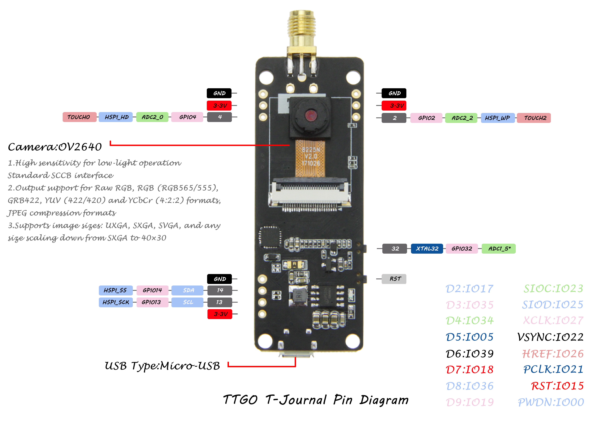

# PROYECTO HORUS: Demo en Arduino C para TTGO-CAM

Código demo en C de ARDUINO para el consumo de la API de reconocimiento (Proyecto Horus)

El Proyecto Horus consiste en una API REST que permite de forma simple identificar imagenes via redes neuronales.

# Cargar el codigo en la TTGO-CAM

A diferencia de la ESP32-Cam la TTGO-Cam ya incluye un conversor USB a TTL al mejor estilo Arduino por lo que no requiere conexionados especiales:

La configuración del entorno arduino para la carga sera:

# Dentro de las funciones de la API podemos encontrar

El Proyecto Horus consiste en una API REST que permite de forma simple identificar imágenes vía redes neuronales.

- FACE ID
- OBJECT DETECTION
- QR DECODER
- ID DECODER
- APLR (AUTOMATIC PLATE LICENSE RECOGNITION)

Administra la API usando la app instalable 
https://www.proyectohorus.com.ar/descargas/windows/admin.zip

Administra la API usando nuestro administrador web 
https://www.proyectohorus.com.ar/administrador

Administra la API directo desde tu back usando la documentación en Swagger https://www.proyectohorus.com.ar/Documentacion/Administrador.json

La URL a usar en el codigo de ejemplo es:
https://server1.proyectohorus.com.ar

El usuario, Password y Perfil se obtienen en esta primer etapa desde el software descargable.

Ejemplo de como usar el administrador aca:

https://www.youtube.com/watch?v=pf7yy0KpRks&t=3s
